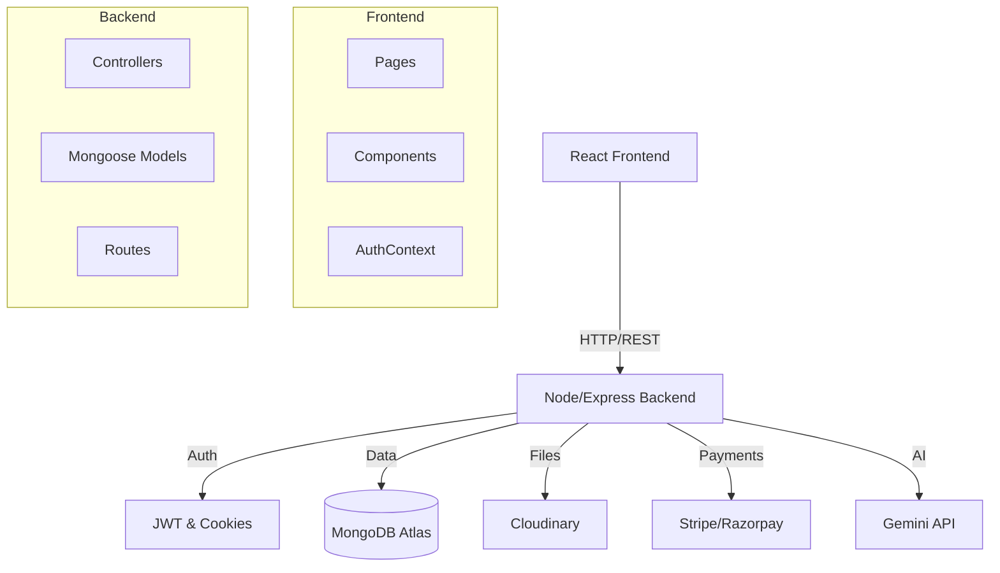

# NotesShare - University Notes Marketplace

A production-grade full-stack web application where students can buy/sell notes.

## Features
- **Role-based Auth**: Students & Admins (@stu.adamasuniversity.ac.in emails only).
- **Marketplace**: Buy/Sell notes with Stripe/Razorpay.
- **Admin Panel**: Manage users, upload official notes, view stats.
- **Chat Assistant**: AI-powered study helper using Gemini.
- **Glassmorphism UI**: Modern, responsive design.

## System Architecture



## Tech Stack
- **Frontend**: React, Vite, Tailwind CSS, Framer Motion.
- **Backend**: Node.js, Express, MongoDB, Cloudinary.
- **Payments**: Stripe, Razorpay.

## Setup Instructions

1. **Clone the repository**
2. **Install Dependencies**
   ```bash
   cd backend && npm install
   cd ../frontend && npm install
   ```
3. **Environment Variables**
   - Copy `.env.example` to `backend/.env` and fill in the values.
4. **Run Locally**
   - Backend: `cd backend && npm run dev`
   - Frontend: `cd frontend && npm run dev`
5. **Seed Data**
   ```bash
   cd seed && node seed.js
   ```

## Deployment
- **Frontend**: Deploy to Vercel/Netlify.
- **Backend**: Deploy to Render/Heroku.
- Ensure environment variables are set in the deployment platform.

## API Documentation
Import `postman_collection.json` into Postman to test the API.
